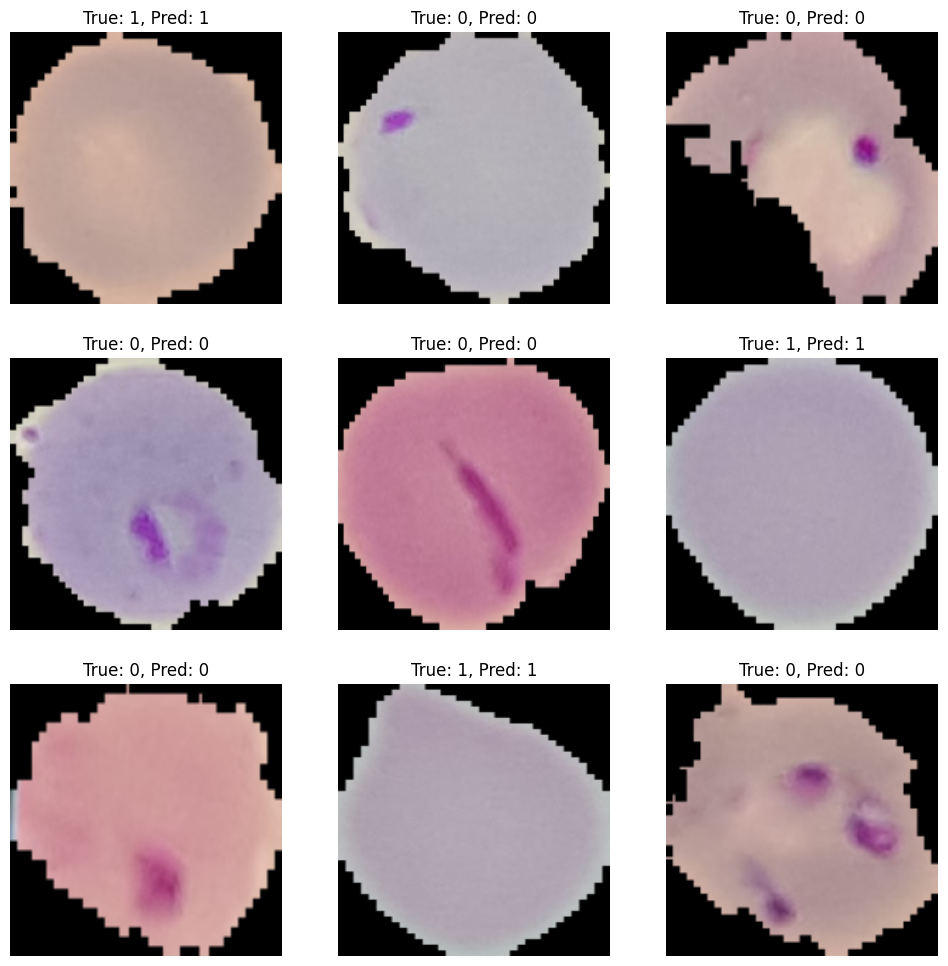

# Malaria Detection Using Deep Learning



This project demonstrates how to build a deep learning model using TensorFlow to detect malaria-infected cells from a dataset of cell images. The tutorial covers various techniques including **data augmentation**, **transfer learning**, and **dropout** to enhance the model's performance.

## Table of Contents
- [Overview](#overview)
- [Dataset](#dataset)
- [Model Architecture](#model-architecture)
- [Techniques Used](#techniques-used)
- [Results](#results)
- [Installation](#installation)
- [Usage](#usage)
- [Contributing](#contributing)
- [License](#license)

## Overview
Malaria is a serious and sometimes fatal disease caused by parasites that are transmitted to people through the bites of infected mosquitoes. To aid in quicker diagnosis, this project aims to automatically detect infected cells using deep learning models.

The notebook in this repository provides a step-by-step guide to:
1. Load and preprocess the Malaria dataset.
2. Build and train a Convolutional Neural Network (CNN).
3. Apply **data augmentation** to enhance generalization.
4. Implement **transfer learning** using MobileNetV2.
5. Incorporate **dropout** to prevent overfitting.
6. Evaluate model performance using metrics like **accuracy** and **F1 score**.

## Dataset
The dataset used in this project is from [TensorFlow Datasets](https://www.tensorflow.org/datasets) and contains labeled images of cell slides:
- **Parasitized** (Malaria-infected cells)
- **Uninfected** (Healthy cells)

You can learn more about the dataset [here](https://www.tensorflow.org/datasets/catalog/malaria).

## Model Architecture
We implemented a baseline CNN model and progressively enhanced it using:
- **Transfer Learning** with MobileNetV2 as a feature extractor.
- **Data Augmentation** to introduce diversity in the training set.
- **Dropout** layers to regularize and prevent overfitting.

The final model was evaluated using test data and achieved high accuracy.

## Techniques Used
- **Convolutional Neural Networks (CNNs)**: A deep learning technique used for image classification tasks.
- **Data Augmentation**: Random flips, rotations, and zooms to increase training sample diversity.
- **Transfer Learning**: Leveraged the pre-trained MobileNetV2 model for feature extraction.
- **Dropout**: Used to prevent overfitting by randomly disabling neurons during training.
- **Evaluation**: Measured accuracy, precision, recall, and F1 score to assess model performance.

## Results
The final model achieved a high F1 score of **0.95**, indicating that it can accurately distinguish between parasitized and uninfected cells. You can see the visual predictions of the model on test images in the notebook.

## Installation
To run this project locally, follow these steps:

1. **Clone the repository**:
   ```bash
   git clone https://github.com/JordanWhite34/MalariaDetection.git
   cd MalariaDetection
   ```

2. **Create a virtual environment** (recommended):
   ```bash
   python -m venv venv
   source venv/bin/activate  # On Windows use `venv\Scripts\activate`
   ```

3. **Run the notebook**:
   Open the `MalariaDetection.ipynb` file in Jupyter Notebook or Visual Studio Code and execute the cells.

## Usage
Once the environment is set up, you can open the Jupyter notebook and run the cells to:
- Install required dependencies.
- Load the dataset.
- Train the model using different techniques.
- Evaluate the model using metrics like accuracy and F1 score.
- Visualize the predictions on test images.

## License
This project is licensed under the MIT License. See the [LICENSE](LICENSE) file for details.
